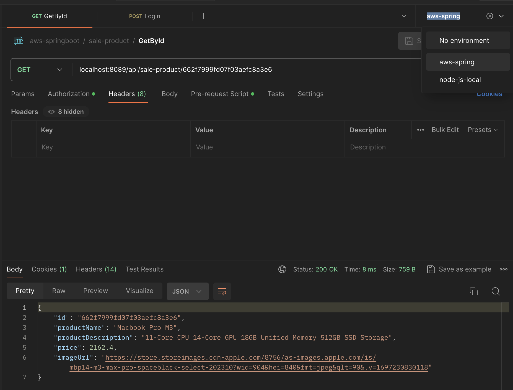

# Springboot with AWS

Springboot services integrate with AWS services

### Prerequisites
- Java 21 / OpenJDK - [Java Download](https://www.oracle.com/java/technologies/downloads/)

- Docker - [Install Docker](https://docs.docker.com/engine/install/)

-----

### Run apps for Development

If you are intellij user, simply open any services directory then resolve their dependency and run 

Following steps below examine how to start application with IntelliJ

- Open Intellij
- Click Open Button on welcome dialog
- Choose either application directory
- (optional) After you open project diretory, it should resolve dependencies by pom, if not then just click "File" on top menu bar, select "New" > "Module from Existing Sources" and select pom inside app directory
- (optional) After the dependencies are resolved, it should not show any error in file navigation, try to build by press command + F9 or Ctrl + F9
- Start your application by right click on ${appName}Application file and select "Run ...main()"
- By running spring app class, spring will look up docker compose file specified in application.yaml then pull and run necessary containers for you

Happy coding!

-----

### Postman collection

- import collection and env in postman-collection

- select env from post man file

- in order to access authenticated APIs (like product service), start authentication service and call any request

- normally when you start non-auth components, they use "compose-with-auth.yaml" which contains authencation service for you so you dont need to start authentication service everytime

- All requests should come with pre-request authentication script

-----

### Add external services for your application
Like MongoDB, you can add any services on your local development
Simply by defining services in compose.yaml - [Docker Compose](https://docs.docker.com/compose/gettingstarted/#step-2-define-services-in-a-compose-file)

-----

### MongoDB initial Data

- Add json file in ./mongodb-dumb

- Each new row, u can use online oid generator https://observablehq.com/@hugodf/mongodb-objectid-generator

- Add mongoimport command with correct database, collection and file path in compose.yaml

##### Heads up for the import command, it will fail after it is successfully executed once because duplicated OID, but new item with new OID will pass